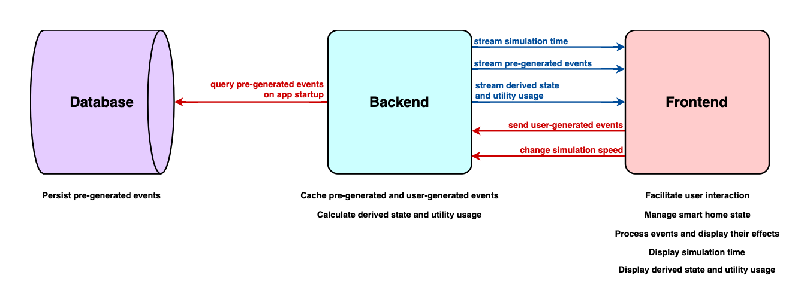
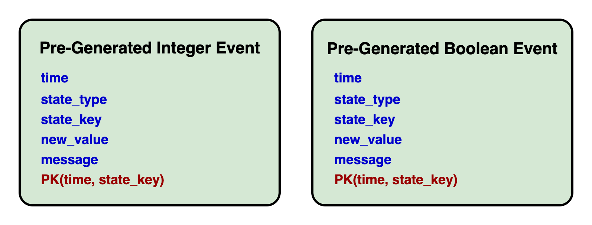

# Design

## Team 3

- Steven Capleton
- Landon Dyken
- Karen Horton
- Eric Latham
- Brittany Latham
- Laura Thompson

## High-Level Runtime Model

Our smart home dashboard simulator is an event-based application that operates according to the following runtime model:



The entire design of the app is meant to be fast, space-efficient, and simple.

## Smart Home State

The smart home has state under the following `keys`.

### Integer State

Integer state represents basic temperature measurements in degrees Fahrenheit.

- `outdoorTemp`
- `thermostatTemp`

### Boolean State

Boolean state represents things that can be open/closed or on/off, including doors, windows, and appliances.

True = open/on
False = closed/off

#### Bedrooms

##### Bedroom #1

- `bedroom1OverheadLight`
- `bedroom1Lamp1`
- `bedroom1Lamp2`
- `bedroom1Window1`
- `bedroom1Window2`
- `bedroom1Tv`

##### Bedroom #2

- `bedroom2OverheadLight`
- `bedroom2Lamp1`
- `bedroom2Lamp2`
- `bedroom2Window1`
- `bedroom2Window2`

##### Bedroom #3

- `bedroom3OverheadLight`
- `bedroom3Lamp1`
- `bedroom3Lamp2`
- `bedroom3Window1`
- `bedroom3Window2`

#### Bathrooms

##### Bathroom #1

- `bathroom1OverheadLight`
- `bathroom1ExhaustFan`
- `bathroom1Window`
- `bathroom1Faucet`

##### Bathroom #2

- `bathroom2OverheadLight`
- `bathroom2ExhaustFan`
- `bathroom2Window`
- `bathroom2Faucet`

#### Living Room

- `livingRoomOverheadLight`
- `livingRoomLamp1`
- `livingRoomLamp2`
- `livingRoomTv`
- `livingRoomWindow1`
- `livingRoomWindow2`
- `livingRoomWindow3`

#### Kitchen

- `kitchenOverheadLight`
- `kitchenStove`
- `kitchenOven`
- `kitchenMicrowave`
- `kitchenRefrigerator`
- `kitchenDishWasher`
- `kitchenWindow1`
- `kitchenWindow2`

#### Garage

- `garageHouseDoor`
- `garageCarDoor1`
- `garageCarDoor2`

#### Other

- `frontDoor`
- `backDoor`
- `clothesWasher`
- `clothesDryer`

### Derived State

Derived state is dependent on other state and is not included in [events](#events) because it has to be [calculated](#derived-state-utility-usage-publisher).

- `indoorTemp`: float representing the indoor temperature of the smart home in degrees Fahrenheit

## Events

Events change specific pieces of smart home state at specific times.

### Attributes

- `time` is the number of seconds after the start of the simulation at which the event occurred
- `state_type` is the type of state that the event changes, which determines how the event is processed
- `state_key` is the key to the value in smart home state that the event changed
- `new_value` is the new value for `state_key` in smart home state after the event
- `message` is a human-readable description of the event to be displayed to the user

### Pre-Generated Events

Pre-generated events are the backbone of the smart home simulation. They:

- define the base smart home state over a 2-month time period
- are generated and stored in a database before the app runs
  - See [the pseudocode](./pseudocode.md#pre-generated-events) and [the actual code](../generate_events.py).
- are based on the provided family schedule and downloaded weather data
- initialize values for all smart home state (other than [derived state](#derived-state)) at `time=0`
- do not change the values of `thermostatTemp` or `kitchenRefrigerator` after initialization
- are uniquely identifiable by `time` and `state_key`

#### Database Model

The database stores pre-generated events in a relational database (Postgres) schema with two (almost identical) sibling tables: one for [integer state events](#integer-state-events) and one for [boolean state events](#boolean-state-events).



### User-Generated Events

User-generated events are events triggered by the user and created at runtime. They:

- are never stored in a database
- are kept in memory at runtime
- are included in [calculations of derived state and utility usage](#derived-state-utility-usage-publisher)
- take precedence over pre-generated events during calculations when there is a conflict by `time` and `state_key`

### Integer State Events

These are events that change [integer state](#integer-state).

#### Pre-Generated Events Database Table

```sql
CREATE TABLE IF NOT EXISTS pre_generated_events.integer_event (
    time        integer NOT NULL,
    state_type  integer_state_type NOT NULL,
    state_key   integer_state_key NOT NULL,
    new_value   integer NOT NULL,
    message     text NOT NULL,
    PRIMARY KEY (time, state_key)
);
```

`integer_state_type` is a singleton enumeration containing `"temp"`.

`integer_state_key` is an enumeration containing all [integer state](#integer-state) keys.

### Boolean State Events

These are events that change [boolean state](#boolean-state) to open/close something or turn something on/off.

#### Pre-Generated Events Database Table

```sql
CREATE TABLE IF NOT EXISTS pre_generated_events.boolean_event (
    time        integer NOT NULL,
    state_type  boolean_state_type NOT NULL,
    state_key   boolean_state_key NOT NULL,
    new_value   boolean NOT NULL,
    message     text NOT NULL,
    PRIMARY KEY (time, state_key)
);
```

`boolean_state_type` is an enumeration containing:

- `"door"`
- `"window"`
- `"light"`
- `"bedroomTv"`
- `"livingRoomTv"`
- `"stove"`
- `"oven"`
- `"microwave"`
- `"refrigerator"`
- `"dishWasher"`
- `"shower"`
- `"bath"`
- `"bathExhaustFan"`
- `"clothesWasher"`
- `"clothesDryer"`

`boolean_state_key` is an enumeration containing all [boolean state](#boolean-state) keys.

## Backend Design

### App Clock

The app clock represents time with flexible speed in a bounded (2-month) timeframe, and it is used to keep time in the app's simulation of smart home events.

The app clock allows:

- running the smart home simulation at different speeds
- changing speeds at runtime without losing the current place in time
- restarting app time from the minimum app time at any point

See [AppClock.py](../public/time/AppClock.py).

#### Minimum Speed

```txt
1  real second  =  1  app second
```

#### Maximum Speed

```txt
1   real second   =  1     app hour
1   real second   =  3600  app seconds
```

### Event Store

The event store is an object that wraps an [EventMap](#event-map) storing all events during the smart home simulation.

The event store supports:

- efficiently inserting pre-generated events at simulation start
- efficiently inserting user-generated events at runtime
- efficiently removing user-generated events at simulation restart
- efficiently iterating over specific groups of events filtered by time, state key, and event type (pre-generated or user-generated)

See [EventStore.py](../public/events/EventStore.py).

#### Event Map

`EventMap` is a custom map data structure that indexes events by time, state key, and event type (pre-generated or user-generated) to support fast insertions and retrievals:

```python
{
    0: {
        "state_key0": {
            "pre-generated": <unique event>,
            "user-generated": <unique event>
        },
        "state_key1": {
            "pre-generated": <unique event>,
            "user-generated": <unique event>
        },
        ...
    },
    1: {
        "state_key2": {
            "pre-generated": <unique event>,
            "user-generated": <unique event>
        },
        "state_key3": {
            "pre-generated": <unique event>,
            "user-generated": <unique event>
        },
        ...
    },
    ...
}
```

Retrieving or removing many events at once requires iterating over app time, which results in `O(1)` time complexity because app time is bounded by constants.

See [EventStore.py](../public/events/EventStore.py).

### Server-Sent Event Publishers

Server-sent events (SSE) provide an efficient and scalable alternative to traditional request models.

SSE can be leveraged to effectively "stream" events from the server to the client in many different contexts, which goes along with other reactive programming techniques.

The app publishes different types of SSE from a [SSE-compatible Flask app](https://www.velotio.com/engineering-blog/how-to-implement-server-sent-events-using-python-flask-and-react) on intervals of real time and app time via a background scheduler with a thread pool.

See [SSEPublisher.py](../public/sse/SSEPublisher.py).

#### Simulation Time Publisher

The simulation time publisher sends the current absolute simulation time (the current time of the [app clock](#app-clock) counted from a constant start date) and the current simulation speed (the current speed of the [app clock](#app-clock)) as a SSE to the frontend to be displayed **every real second**.

See [TimePublisher.py](../public/time/TimePublisher.py).

#### Pre-Generated Events Publisher

The pre-generated events publisher sends all unprocessed past events from [the event store](#event-store) as SSEs to the frontend to be processed at **every 30 seconds of app time**.

See [EventPublisher.py](../public/events/EventPublisher.py).

#### Derived State & Utility Usage Publisher

The [derived state](#derived-state) and utility usage publisher calculates and sends as a SSE the current indoor temperature and the total utility usage since the last calculation based on events that occurred since the last calculation at **every 30 minutes of app time**.

##### Measurement Units

- All time values are represented in app seconds.
- All temperature values are represented in degrees Fahrenheit.
- All electricity values are represented in watts.
- All water values are represented in gallons.
- All money values are represented in dollars.

See [the pseudocode](./pseudocode.md#indoor-temperature-utility-usage) and [the actual code](../public/analysis).

## Frontend Design

The frontend is a React/TypeScript app comprised of several components that display data sent from the backend and allow the user to adjust certian values in the simulation.

The internal workings of the frontend are considerably simpler than that of the backend, mainly because most of what the frontend does is _react_ to events that are sent to it.

For user actions (such as actions affecting the [app clock](#app-clock) or [smart home state](#smart-home-state)), the frontend sends basic HTTP requests to the backend to process them.

See [the requirements document](requirements.md) for information about what the frontend looks like and what it can do.

### The `App` Component

`App` is the root component of the frontend. It:

- is always rendered
- acts as a container that renders the selected [app screen](requirements.md#application-screens)
- subscribes to [SSE channels](#server-sent-event-publishers) established by the backend
- manages state for all of the app screens
  - stores state for each app screen within its own state
  - passes the appropriate state object and a function for updating it as props to the selected app screen component
  - updates state for the appropriate app screens when it receives state-changing SSEs

The `App` component essentially renders one selected app screen at a time, while processing all events for the other app screens in the background, which allows the simulation to run accurately and efficiently.

See [App.tsx](../src/App.tsx).
