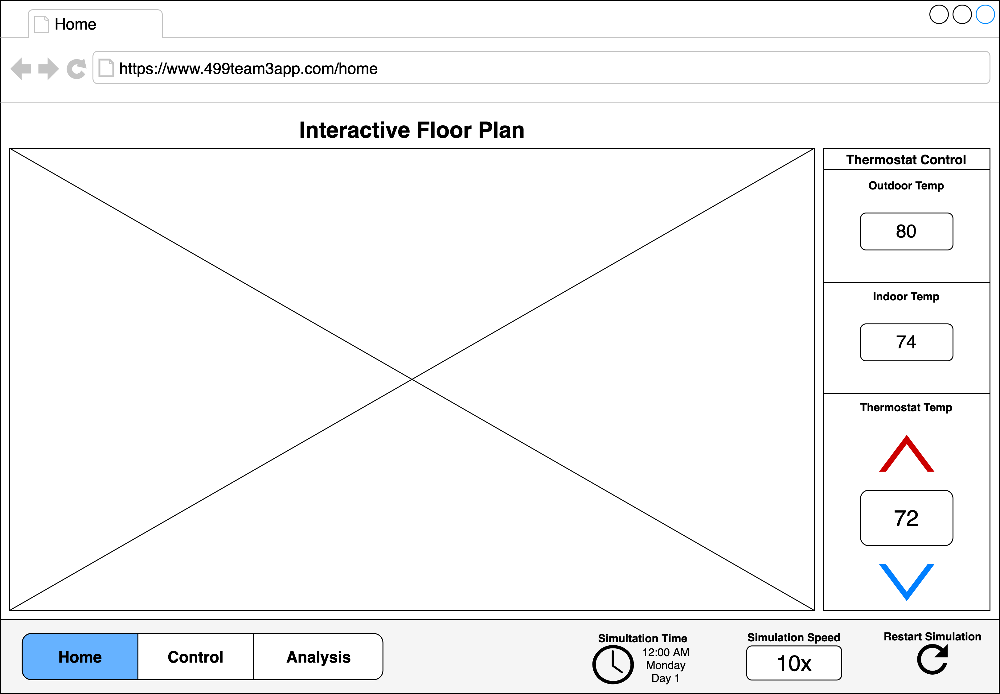
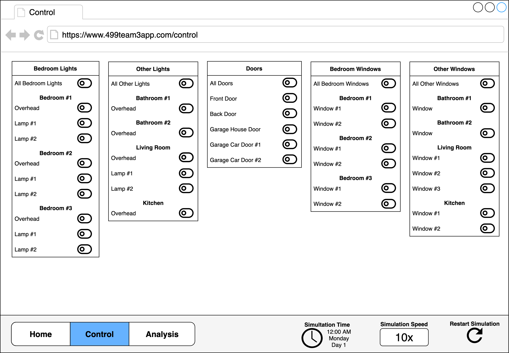
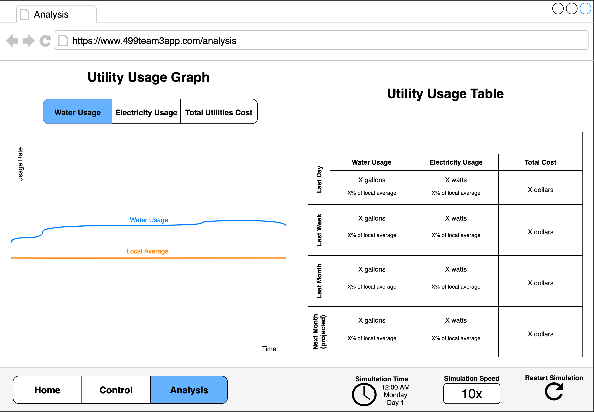
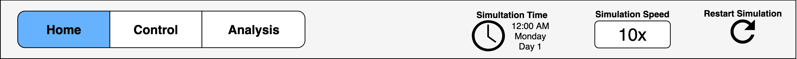

# Requirements

## Team 3

- Steven Capleton
- Landon Dyken
- Karen Horton
- Eric Latham
- Brittany Latham
- Laura Thompson

## Overview

### Smart Home Simulation

The user should be able to:

- watch pre-generated events stream through the smart home dashboard
- restart the simulation by clicking a button or refreshing the page
- change the speed of the simulation

### Live User Interaction

The user should be able to:

- set the thermostat
- turn lights on and off
- open and close windows and doors

Each of these user actions should:

- update the smart home state
- display a visible change in the user interface
- be included in [data analysis](#data-analysis) calculations

### Data Analysis

#### Utility Usage

The user should be able to view utility usage and cost data for:

- the **last day**
- the **last week**
- the **last month**
- the **next month** (projected)

## Application Screens

The following sections illustrate and describe the various screens and components the application should have to satisfy the above general requirements.

### Home Screen

#### Interactive Floor Plan

This component should show all of the rooms, doors, windows, and appliances in the smart home.

As the smart home state changes at runtime, the component should indicate:

- what lights are on and off
- what doors are open and closed
- what windows are open and closed

The component should also allow the user to turn specific lights on or off by clicking on them.

#### Thermostat Control

This component should:

- display the current indoor, outdoor, and thermostat temperature values
- allow the user to change the thermostat temperature setting

### Control Screen

This screen should contain controls that allow the user to:

- turn each individual light on or off
- open or close each individual door and window

### Analysis Screen

#### Utility Usage Graph

This component should allow the user to view live-updated graphs of the smart home's utilities data, including the water usage rate, the electricity usage rate, and the total utilities cost rate.

##### Water Usage

This live-updated graph should display the following data:

- the **water usage rate** trend from the start of the simulation to now
- the **local average water usage rate** as a horizontal line (related to the additional [utility usage comparison feature](#utility-usage-comparison))

##### Electricity Usage

This live-updated graph should display the following data:

- the **electricity usage rate** trend from the start of the simulation to now
- the **local average electricity usage rate** as a horizontal line (related to the additional [utility usage comparison feature](#utility-usage-comparison))

##### Total Utilities Cost

This live-updated graph should display the following data:

- the **total utilities cost rate** trend from the start of the simulation to now

#### Utility Usage Table

This component should display a table like the following:

|                        | Water Usage                 | Electricity usage         | Total Cost |
| ---------------------- | --------------------------- | ------------------------- | ---------- |
| Last Day               | gallons, % of local average | watts, % of local average | dollars    |
| Last Week              | gallons, % of local average | watts, % of local average | dollars    |
| Last Month             | gallons, % of local average | watts, % of local average | dollars    |
| Next Month (projected) | gallons, % of local average | watts, % of local average | dollars    |

Important details:

- Cells for water and electricity usage should include percentages calculated with the additional [utility usage comparison feature](#utility-usage-comparison).
- Projections for next month's utility usage should be calculated with the additional [advanced utility usage projection feature](#advanced-utility-usage-projection).

### All Screens

#### Menu Bar

All screens should include a menu bar at the top that contains the following:

- links to all application screens so that the user can switch between them
- the current simulation time
- a simulation speed control component that allows the user to speed up or slow down the simulation
- a button to restart the simulation

## Additional Features

The following sections describe features to be implemented by the BA students on the team related to their minors.

### Smart Home Marketing Pitch

- **Student**: Steven Capleton
- **Minor**: Economics
- **Description**: Present study findings that promote economic reasons to have a smart home automated system.

### Advanced Utility Usage Projection

- **Student**: Landon Dyken
- **Minor**: Mathematics
- **Description**: Calculate next month utility usage projections in a smart and accurate way based on past events.

### Web Design Style Guide

- **Student**: Karen Horten
- **Minor**: Business
- **Description**: Create a web design style guide to ensure that each web page of the application is styled in an attractive and consistent way.

### Utility Usage Comparison

- **Student**: Brittney Latham
- **Minor**: Mathematics
- **Description**: Compare the smart home's utility usage with utility usage averages from other homes in the area.
